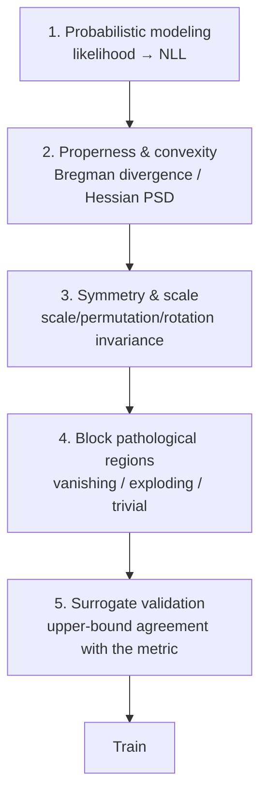

# Loss-Scout Guidebook — Designing Loss Functions with a Pre-Training Scan

> **Model-free loss landscape diagnostics.** Scan the output-space gradient and
> curvature of any loss formula *before* you train, using only the formula.

---

## 1. The core idea

The chain rule splits a model's parameter gradient into two factors:

$$
\nabla_\theta L = \underbrace{\frac{\partial L}{\partial \hat y}}_{\text{loss only}}
\cdot \underbrace{\frac{\partial \hat y}{\partial \theta}}_{\text{architecture}}
$$

The second factor is architecture-specific and expensive to probe. But the first
factor — the **output-space gradient** $\partial L / \partial \hat y$ — and its
second derivative $\partial^2 L / \partial \hat y^2$ are **fully determined by the
loss formula alone**. If the loss has a dead zone, a cliff, or a trivial minimum in
prediction space, *no* architecture (Transformer, U-Net, whatever) can escape it:
the optimizer is driven by $\partial L/\partial \hat y$ first.

Loss-Scout sweeps the prediction $\hat y$ over a domain and reports four
domain-agnostic pathologies:

| # | Pathology | Signal | Consequence |
|---|---|---|---|
| 1 | **Vanishing gradient** | $\|g\|\to 0$ in the "wrong answer" region | Model gets stuck while confidently wrong |
| 2 | **Zero ambiguity-escape force** | $\|g\|\to 0$ at the decision boundary | Model stays at a uniform / uninformative output |
| 3 | **Trivial-solution trap** | A constant output nearly minimizes the loss | Model ignores the input (shortcut) |
| 4 | **Curvature explosion** | $\|h\|$ unbounded | NaN / training instability |

---

## 2. The five-step loss engineering framework

Before (or instead of) ad-hoc term stacking, follow this standard procedure:



1. **Probabilistic modeling.** Start from "what distribution is the output?"
   Gaussian noise → L2, Laplace noise → L1, Bernoulli → BCE. Never start from
   "how do I measure error".
2. **Properness & convexity.** A *proper scoring rule* is minimized uniquely at
   $P = Q$ (Bregman divergence property). BCE and L2 are proper; hinge and
   0/1 error are not.
3. **Symmetry & scale.** Check scale invariance, permutation invariance, and
   rotational symmetry. (SI-SDR is scale-invariant in the signal gain; that is a
   feature *and* a trap — see `docs/loss_catalog.md`.)
4. **Block pathologies.** This is exactly what Loss-Scout automates.
5. **Surrogate validation.** Confirm the loss upper-bounds / tracks the real
   metric (CER, F1, mAP). A loss that descends while the metric flatlines is a
   broken surrogate.

---

## 3. Quickstart

```bash
pip install -e .

# list built-in losses and domains
loss-scout catalog

# scan one loss
loss-scout scan --loss bce --domain binary_probability
loss-scout scan --loss focal --domain binary_probability --json
loss-scout scan --loss log_magnitude_l1 --domain magnitude --markdown

# render a landscape figure (requires matplotlib)
loss-scout scan --loss bimodal --domain binary_probability --plot bimodal.png
```

Programmatic:

```python
from loss_scout import scan, diagnose, format_report
from loss_scout import scanner as S
from loss_scout import losses as L

d = diagnose(scan(L.bce, S.binary_probability(), loss_name="bce"))
print(format_report(d))          # or to_json(d) / to_markdown(d)

# visualize: loss / gradient / curvature / verdict
from loss_scout import plot_scan
plot_scan(scan(L.bce, S.binary_probability(), loss_name="bce"), d, path="bce.png")
```

---

## 4. How to scan your own loss

A loss in Loss-Scout is any **total, vectorized** function:

```python
def my_loss(y_hat, y):        # y_hat: np.ndarray, y: float target
    ...
    return np.ndarray         # same shape as y_hat
```

Rules:
- Must be **defined for every real `y_hat`** (clip inside `log`/`sqrt`/division).
- Must be **vectorized** (NumPy, not Python loops per element).
- `y` is a scalar target; the domain supplies representative targets.

Then pick (or write) a `Domain` describing the prediction space:

```python
from loss_scout.scanner import Domain, scan
from loss_scout.metrics import diagnose

dom = Domain(
    lo=0.0, hi=1.0,
    targets=(0.0, 1.0),
    ambiguity=0.5,
    is_wrong=lambda yh, t: (yh < 0.5) if t > 0.5 else (yh > 0.5),
    trivial=(0.5, 0.0, 1.0),
)
d = diagnose(scan(my_loss, dom, loss_name="my_loss"))
```

`is_wrong` tells the scanner which region counts as "wrong" per target, so it can
check for vanishing gradient there.

---

## 5. What Loss-Scout can and cannot do

**Can (0.1 s, CPU, no data):**
- Detect vanishing gradient, ambiguity collapse, trivial-solution traps, and
  curvature explosions in *output space*.
- Compare loss families (BCE vs focal vs Dice vs hinge, …) head-to-head.
- Rank candidate losses *before* spending GPU hours.

**Cannot:**
- See parameter-space pathologies (mode collapse across $\theta$, bad basins).
- See architecture-specific dynamics (residual shortcuts, normalization).
- Diagnose **aggregate** losses (Dice/Tversky) with a 1-D sweep — those couple
  all samples and need their per-sample gradient formula; see
  `docs/loss_catalog.md`.

Use Loss-Scout as a **pre-training gate**, not a replacement for post-hoc loss
surface plots.

---

## 6. Thresholds

The diagnostic thresholds are module constants in `loss_scout/metrics.py` and are
documented (with rationale) in `docs/diagnostics.md`. They are deliberately
loose: they separate *clearly* pathological losses from everything else.
